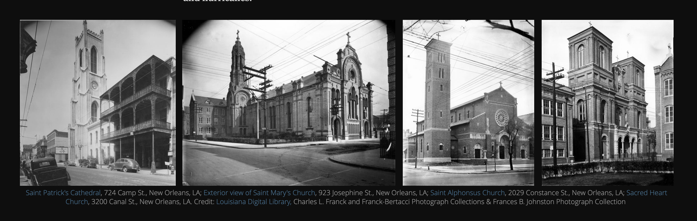

# Directory of Churches and Religious Organizations in New Orleans, 1941

## About
This dataset was compiled for a digital humanities project taken at Pratt Institute's School of Information during Spring 2019. The dataset was made using a digital copy of the WPA directory of religious organizations in New Orleans (1941) and includes the following fields: congregation, national affiliation, sub affiliation, church name, building type, congregation race, and address. Each location with a street address was geocoded and locations with only cross streets provided were estimated using internet searches, archival material, and/or Google Maps. Subsets for Catholic, Baptist, Jewish, and Spriritual Churches were created from the full dataset, all of which are included in this repository.

## Projects 
WPA dataset was used for this [ArcGIS Story Map](https://www.arcgis.com/apps/Cascade/index.html?appid=b3a2f898c0ac49819c6faf09e9d80603) about the religious landscape of New Orleans during the New Deal. 

This data was also mapped with [Mapping Inequality](https://dsl.richmond.edu/panorama/redlining/) data to show that readlining often occurred in black communities, where black churches were located. You can view the map of redlining in relation to church location [here](http://www.arcgis.com/home/webmap/viewer.html?webmap=6f1bbb334220417295f97d3019ff83cd) and also read more about the process of making this map in this [NYARC blog post](http://nyarc.org/content/attending-digital-humanities-summer-institute-dhsi). 

## Data Source 
***Directory of Churches and Religious Organizations in New Orleans, 1941***
The original directory was prepared by the Historical Records Survey, Community Service Programs, and Works Project Administration (WPA) and published by the Department of Archives, Louisiana State University, March, 1941

## Possible Uses
Using this dataset is strongly encouraged. Possible (re)uses include, but are not limited to, statistical and spatial analysis as well as research in the fields of religious studies, urban studies, urban development, geography, and race relations in New Orleans. 

For comments or questions about this dataset, please contact at genevieve [dot] milliken [at] gmail [dot] com

Dataset is CC-BY-SA-4.0

